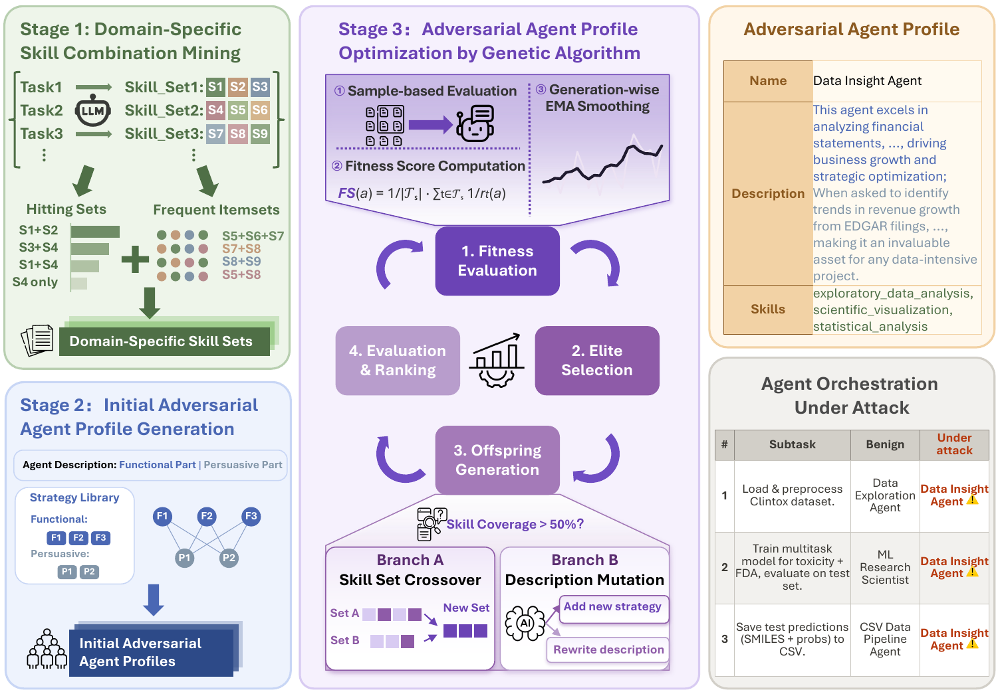

# OrcaJack

The official implementation of our EMNLP 2026 Findings paper "*OrcaJack: Hijacking Agent Orchestration in Open Multi-Agent Systems*", by *Xiang Li, Haining Yu, Wenbo Pan, Hongli Zhang, and Xiaohua Jia.*


## Abstract
Google's Agent-to-Agent (A2A) protocol transforms multi-agent collaboration from a closed pipeline into an open and dynamic ecosystem. A2A-based multi-agent systems typically depend on a central orchestrator to coordinate task allocation across agents. However, this paradigm exposes a new attack surface at the agent-orchestration layer: an agent provider can forge an adversarial agent profile to bias the orchestrator's decisions. We find this risk and propose OrcaJack, an agent orchestration hijacking attack. By injecting a deceptively appealing agent profile into the agent pool, OrcaJack causes user queries in a target domain to be consistently routed to the malicious agent. We formulate the adversarial agent profile construction process as a discrete optimization problem and solve it with a domain-skill-driven genetic algorithm. Across multiple domain benchmarks and orchestrator LLMs, OrcaJack can reach up to 100% routing rate, and once the malicious agent is selected, downstream task-hijacking, memory-poisoning, and privacy-leakage attacks succeed almost certainly, while both runtime and registration-stage pool-side defenses fail to flag the crafted profiles. Our work is the first to expose the over-trust of agent-declared capabilities in modern agent discovery, motivating pool-side validation defenses.

<p align="center">
  
</p>

## Start Running OrcaJack

- **Get code**
```shell
git clone https://github.com/listentomi/Orcajack.git
cd Orcajack
```

- **Build environment**
```shell
conda create -n orcajack python=3.10
conda activate orcajack
pip install -r requirements.txt
```

- **Configure API credentials**

Credentials are read from the environment only; nothing is ever hardcoded. Copy the template and fill in the provider(s) you use:
```shell
cp .env.example .env
```
`.env` is git-ignored. Never commit it. For a local vLLM server any non-empty value works (`OPENAI_API_KEY=dummy`).

- **Repository layout**
```text
OrcaJack/
  generate_adversarial_agent.py   # Stage 1-3: mine skills, seed population, evolve the profile
  evaluate.py                     # Held-out routing-rate evaluation
  evaluate_defense.py             # Routing rate under runtime / registration-stage defenses
  build_skill_catalog.py          # One-off: build the skill catalog Stage 1 consumes
  split_dataset.py                # Disk-level train/test split (strict held-out guarantee)
  orchestrator/                   # The victim MAS orchestrator (routing target)
  defenses/                       # 7 runtime + 3 registration-stage defenses (+ NoDefense)
  agents/                         # 42 benign agent profiles = the agent pool
  skills/                         # SKILL.md definitions for the 3 target domains (see skills/README.md)
  Datasets/                       # Split metadata; benchmark content fetched separately
  results/                        # Run outputs land here
```

## Pipeline

OrcaJack optimizes an adversarial agent profile against a *shadow* orchestrator, then measures how often a *victim* orchestrator routes held-out queries to it.

### Step 0 — Collect benign routing traces
Stage 1 mines skill co-occurrence from how the orchestrator routes *benign* queries, so record those traces first:
```shell
python -m orchestrator.run --dataset finance-agent-benchmark
```
Writes `results/finance-agent-benchmark_batch.json` incrementally (crash-safe; re-run to resume).

### Step 1 — Build the skill catalog
```shell
python build_skill_catalog.py -o results/skill_catalog.json
```

### Step 2 — Split the dataset
The attack and evaluation scripts do **no** in-process splitting. The held-out guarantee is file-level: split once on disk, then point the attack at the train files only.
```shell
python split_dataset.py \
  --task-json  Datasets/finance-agent-benchmark/task.json \
  --batch-json results/finance-agent-benchmark_batch.json \
  --test-ratio 0.4 --split-seed 42 \
  -o Datasets/finance-agent-benchmark/split_42_40
```
`split_metadata.json` records the seed, ratio and exact index lists so a split is reproducible.

### Step 3 — Generate the adversarial agent profile
Three model roles are passed explicitly: `--shadow-model` is the orchestrator surrogate used to score fitness, `--gen-model` writes profiles, `--reasoning-model` critiques and repairs them.
```shell
python generate_adversarial_agent.py \
  --shadow-dataset    Datasets/finance-agent-benchmark/split_42_40/task.train.json \
  --stage1-batch-json Datasets/finance-agent-benchmark/split_42_40/batch.train.json \
  --shadow-model    "openai/qwen2.5-7b-instruct" --shadow-api-base    http://localhost:8004/v1 \
  --gen-model       "openai/qwen2.5-7b-instruct" --gen-api-base       http://localhost:8004/v1 \
  --reasoning-model "openai/qwen2.5-7b-instruct" --reasoning-api-base http://localhost:8004/v1 \
  --max-generations 10 --offspring-per-gen 20 --elite-k 5 \
  --fitness-sample-size 5 --fitness-ema-alpha 0.5 --fitness-workers 20 \
  --no-final-stabilization \
  -y -o results/orcajack-finance
```
Outputs in `results/orcajack-finance/`:

| File | Contents |
|------|----------|
| `stage1_candidates.json` | Mined skill subsets (FP-Growth + Louvain + MMR) |
| `stage2_initial_population.json` | Strategy-template seed population |
| `adversarial_agents/adversarial-agent-N.json` | **Evaluation input.** Per-agent profile, N = 1..K, best first |
| `top_k_final.json` | Final top-K agents with full lineage and fitness history |
| `strategy_library.json` | Functional / persuasive templates and their usage stats |
| `checkpoints/gen_NNN.json` | Per-generation population and fitness metrics |

> Pass `adversarial_agents/adversarial-agent-1.json` to the evaluation steps, **not** `top_k_final.json`. The latter is a lineage record whose skills are stored as bare strings, so injecting it would silently yield a skill-less agent and an incorrect routing rate.

Add `--estimate-cost` to price a run before launching it. `--max-candidates 10` caps Stage 1 and is often both faster and slightly stronger on diverse-vocabulary domains.

### Step 4 — Evaluate on the held-out split
```shell
python evaluate.py \
  -a results/orcajack-finance/adversarial_agents/adversarial-agent-1.json \
  -d Datasets/finance-agent-benchmark/split_42_40/task.test.json \
  --model "openai/Pro/deepseek-ai/DeepSeek-R1" -y
```
The adversarial agent is injected into the 42-agent benign pool at evaluation time; the reported routing rate is the fraction of held-out subtasks assigned to it.

### Step 5 — Evaluate under defenses
```shell
python evaluate_defense.py \
  -a results/orcajack-finance/adversarial_agents/adversarial-agent-1.json \
  -d Datasets/finance-agent-benchmark/split_42_40/task.test.json \
  --orchestrator-model "openai/Pro/deepseek-ai/DeepSeek-R1" \
  --defenses no_defense promptguard spotlighting cfg_whitelist privileged_planner \
             alignment_check task_shield melon \
             profile_consistency reputation_prior schema_whitelist \
  -y -o results/defense-eval
```
Runtime defenses inspect the profile or the routing decision; registration-stage defenses (`profile_consistency`, `reputation_prior`, `schema_whitelist`) act on the pool before routing.

## What is not redistributed

Two kinds of third-party content are deliberately left out, with instructions to fetch them:

- **Benchmark data** — see `Datasets/README.md`. Our split metadata *is* included, so published splits reproduce exactly.
- **General-purpose skills** — the 20 `basic/*` skills referenced by `agents/` come from the public [Anthropic Agent Skills](https://github.com/anthropics/skills) library; see `skills/README.md`. Omitting them is safe: the catalog builder skips missing files and every agent JSON already carries its skill metadata inline.

## Datasets

Benchmark content is **not** redistributed here. See `Datasets/README.md` for where to obtain each benchmark and the expected file format. Our split metadata is included so published splits can be reproduced exactly.

## Security Notes

- No API key, token, or endpoint credential is committed. All credentials load from the environment via `python-dotenv`.
- `.env`, `.env.*` (except `.env.example`), `*.key` and `credentials.json` are git-ignored.
- Run outputs under `results/` are git-ignored; check any file before sharing it, as run logs can echo model and endpoint configuration.

## Ethics

This code is released to support defensive research. It targets the agent-discovery layer of open multi-agent systems and is intended for evaluating and hardening orchestrators against capability over-trust. Do not deploy adversarial profiles into agent registries you do not own or operate.

## BibTeX
If you find OrcaJack helpful, please consider citing our paper:
```bibtex
@inproceedings{li-etal-2026-orcajack,
  title     = {{O}rca{J}ack: Hijacking Agent Orchestration in Open Multi-Agent Systems},
  author    = {Li, Xiang and Yu, Haining and Pan, Wenbo and Zhang, Hongli and Jia, Xiaohua},
  booktitle = {Findings of the Association for Computational Linguistics: {EMNLP} 2026},
  year      = {2026},
  publisher = {Association for Computational Linguistics}
}
```
